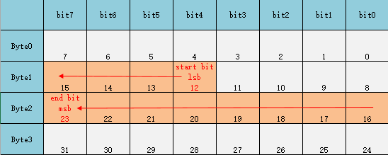

> &emsp;&emsp;声明：如果涉及侵权，请联系本人删除侵权内容。  
> &emsp;&emsp;声明：本文由本人以以往工作经验为依据，总结而得，如果错误，欢迎指正，便于后人参考，少走弯路。

> &emsp;&emsp;最近同事给了一份CAN通信矩阵，看到其中"Byte Order"(排列格式)一栏给出的是"Motorola Msb"时比较疑惑，查看相关资料并结合以往项目经验，总结此文。

# 1. 四个概念

> 这里需要理解以下四个概念
>   - 数据在存储器中的存放顺序
>   - 变量
>   - 数据在CAN报文中的存放顺序
>   - CAN报文数据域传输顺序  

> 为了解释以上四个概念，这里准备一下基础数据：
>   - 使用的数据：0x5A5，对应二进制：010110100101b；
>   - 使用的存储器地址假设以0地址开始；
>   - 使用的变量名：`Uint16 gusVal = 0x5A5;`和`Uint8* gpucPtr;`

## 1.1. 数据在存储器中的存放顺序

> &emsp;&emsp;数据在存储器中存储分大小端方式，目前用过的一款NXP的MCU采用的是大端方式，具体如下：

- 字节中位序 - 升序：lsb在一个Byte的最右边，msb在一个Byte的最左边：
    - Byte：b7-b6-b5-b4-b3-b2-b1-b0
- 字节中位序 - 降序：lsb在一个Byte的最左边，msb在一个Byte的最右边：
    - Byte：b0-b1-b2-b3-b4-b5-b6-b7

- 小端存储：
    - 对于大于一个字节的数据类型的数据，在存储器中，低字节存储在低地址，高字节存储在高地址；
- 大端存储：
    - 对于大于一个字节的数据类型的数据，在存储器中，高字节存储在低地址，低字节存储在高地址；

## 1.2. 变量

- 如果我们直接在程序中使用一个Uint16的变量，不使用指针时，不会有疑惑，使用方式如下：
    - 获取该变量的低字节：`Uint8 Temp = (Uint8)(gusVar & 0xFF)`
    - 获取该变量的高字节：`Uint8 Temp = (Uint8)((gusVar >> 8) & 0xFF)`
    - 将该变量赋给其他变量：`Uint16 Temp = gusVar;`
- 如果我们使用指针来获取存储在0和1地址的值"0x5A5"，分为一下情况：
    - 存储方式是大端，0地址放0x05，1地址放0xA5:
        ```C
            gpucPtr = (Uint8*)0;
            gusVal |= (Uint16)(*gpucPtr << 8);
            gpucPtr = (Uint8*)1;
            gusVal |= (Uint16)*gpucPtr;
        ```
    - 存储方式是小端，0地址放0xA5，1地址放0x05;
        ```C
            gpucPtr = (Uint8*)0;
            gusVal |= (Uint16)*gpucPtr;            
            gpucPtr = (Uint8*)1;
            gusVal |= (Uint16)(*gpucPtr << 8);            
        ```

## 1.3. 数据在CAN报文中的存放顺序

- CAN报文每个报文可包含8Byte的字节数据域，在报文内数据的字节序和位序如下：
    - 字节序：Byte0、Byte1、Byte2、Byte3、Byte4、Byte5、Byte6、Byte7
    - 位序：bit7、bit6、bit5、bit4、bit3、bit2、bit1、bit0
- 目前遇到的项目中都是这么排序的，这也应该是CAN2.0标准格式，但未详查，如有出入望纠正；

### 1.4. CAN报文数据域传输顺序

- 字节顺序：先传Byte0，最后传Byte7；
- 字节内位序：先传bit7，最后传bit0；
- 目前遇到的项目中都是这么排序的，这也应该是CAN2.0标准格式，但未详查，如有出入望纠正；

# 2. CAN信号映射

> &emsp;&emsp;在项目中遇到过CAN报文填充**信号**时，出现字节序出错的现象，大概总结有三种针对信号和CAN报文中数据域的映射方式：Intel、Motorola_MSB和Motorola_LSB。  
> &emsp;&emsp;在使用 CANdb++编辑器时发现，对于字节序的选择只有Intel和Motorola两种格式，通过查看之前的dbc文件，发现这里采用的是Motorola_LSB的方式。


## 2.1. 缩写

- LSB：least significant byte(CAN某个信号的最低字节)
- MSB：most significant byte(CAN某个信号的最高字节)
- lsb：least significant bit(CAN某个信号中某个字节的最低有效位)
- msb：most significant bit(CAN某个信号中某个字节的最高有效位)

## 2.2. CAN信号映射

> &emsp;&emsp;还是以数据"0x5A5"来解释，这里做如下假设：信号值0x5A5，开始位置为第二个字节Byte1的bit4。

### 2.2.1. Intel(小端)

- 信号值：0x5A5，二进制：010110100101b
- 信号起始位：byte1的bit4，在报文中的索引是12
- 信号长度：12bit




### 2.2.2. Motorola_LSB(大端)

- 信号值：0x5A5，二进制：010110100101b
- 信号起始位：byte1的bit4，在报文中的索引是12
- 信号长度：12bit


### 2.2.3. Motorola_MSB(大端)

- 信号值：0x5A5，二进制：010110100101b
- 信号起始位：byte1的bit4，在报文中的索引是12
- 信号长度：12bit


# 3. 刚开始的猜想

> &emsp;&emsp;刚开始对Motorola_MSB和Motorala_LSB的理解如下，总结在这里方便有感兴趣的人理解。

## 3.1. Motorola_MSB(错误!)

- 信号值：0x5A5，二进制：010110100101b
- 信号起始位：byte1的bit4，在报文中的索引是12
- 信号长度：12bit


## 3.1. Motorola_LSB(错误!)

- 信号值：0x5A5，二进制：010110100101b
- 信号起始位：byte1的bit4，在报文中的索引是12
- 信号长度：12bit


# 4. 总结

> &emsp;&emsp;Motorola_LSB和Motorola_MSB的区别是某个信号起始位置确定的情况下，在报文中的映射空间不一样，映射顺序一样(低字节放在高字节，高字节放在低地址，位序都是从右到左是b0到b7)。
> &emsp;&emsp;而我刚开始的错误理解是，两者的在报文中的映射空间是一样的，映射顺序不一样。

# 5. 备注

- 本文中讲到的信号只会占用CAN报文的前三个字节，为了使文档看起来整洁，只保留了CAN报文的前四个字节的截图，不可误以为CAN报文只有4个字节。


